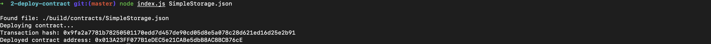

# Task 2
## 1. Deployed contract

## 2. Transaction hash from the contract deployment
0x9fa2a7781b78250501170edd7d457de90cd05d8e5a078c28d621ed16d25e2b91

## 3. Deployed contract address from the contract deployment
0x013A23FF077B1eDEC5e21CABe5dbB8AC8BCB76cE