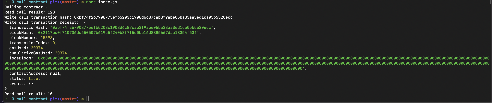

# Task 3
## 1. Screenshot of the console output immediately after you have successfully issued a smart contract call.

## 2. The transaction hash from the console output (in text format).
0xbf74f267908775efb5203c1908d6c87cab3f9abe05ba33aa3ed1ca05b5520ecc
## 3. The contract address that you called (in text format).
0x013A23FF077B1eDEC5e21CABe5dbB8AC8BCB76cE
## 4. The ABI for contract you made a call on (in text format).
```json
[
  {
    inputs: [],
    stateMutability: "payable",
    type: "constructor",
  },
  {
    inputs: [
      {
        internalType: "uint256",
        name: "x",
        type: "uint256",
      },
    ],
    name: "set",
    outputs: [],
    stateMutability: "payable",
    type: "function",
  },
  {
    inputs: [],
    name: "get",
    outputs: [
      {
        internalType: "uint256",
        name: "",
        type: "uint256",
      },
    ],
    stateMutability: "view",
    type: "function",
  },
]
```