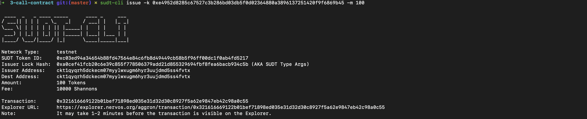
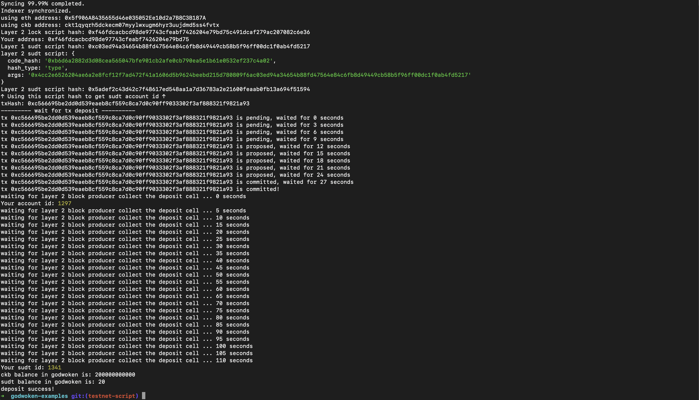

# Task 4
## 1. A link to the Layer 1 address you funded on the Testnet Explorer.
[https://explorer.nervos.org/aggron/address/ckt1qyqrh5dckecm07myylwxugm6hyr3uujdmd5ss4fvtx](https://explorer.nervos.org/aggron/address/ckt1qyqrh5dckecm07myylwxugm6hyr3uujdmd5ss4fvtx)
## 2. A screenshot of the console output immediately after using sudt-cli to create your SUDT tokens on Layer 1.

## 3. A link to the transaction ID created by sudt-cli on the Testnet Explorer.
[https://explorer.nervos.org/aggron/transaction/0x321616669122b01bef71898ed035e31d32d30c8927f5a62e9847eb42c98a0c55](https://explorer.nervos.org/aggron/transaction/0x321616669122b01bef71898ed035e31d32d30c8927f5a62e9847eb42c98a0c55)
## 4. A screenshot of the console output immediately after you have successfully submitted a deposit to Layer 2 using the account-cli tool.

## 5. The SUDT ID from the console output after executing the deposit script (in text format).
1329
